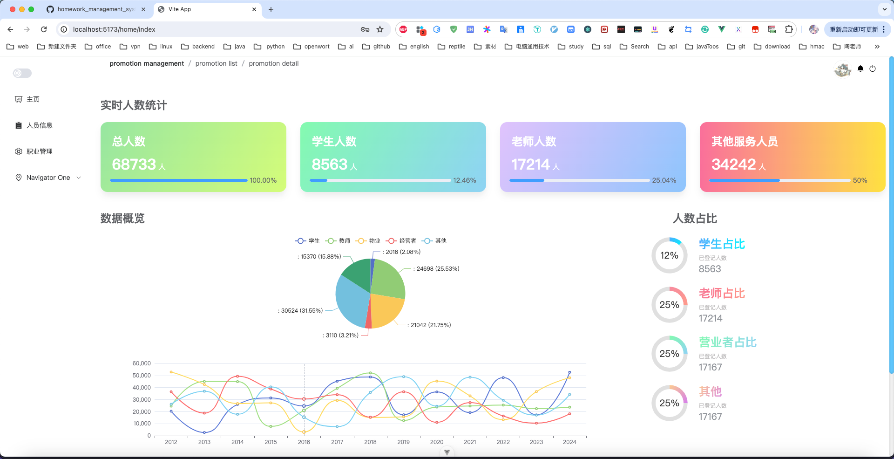
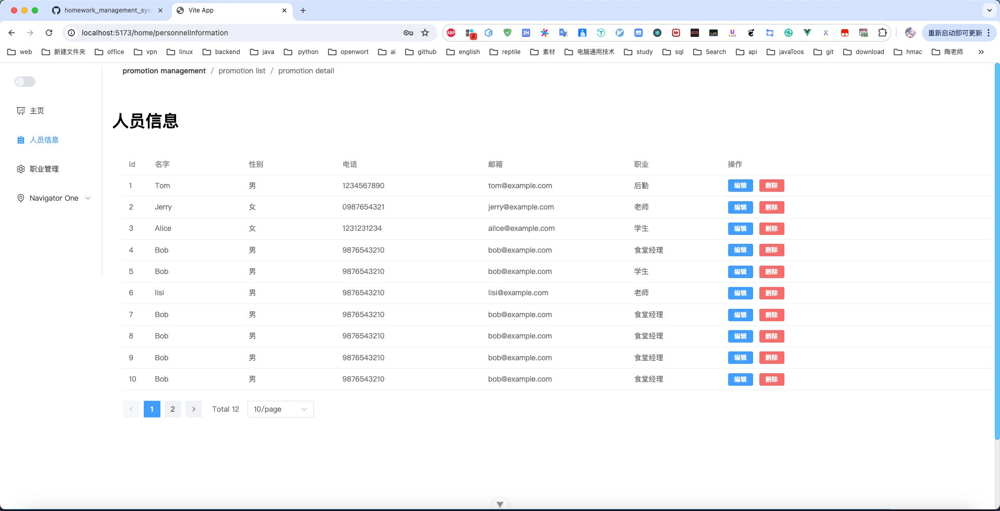

# 默认用户名密码
登录用户名：`18187294890`
密码：`11`
万能验证码：`1234`
## 运行效果：




# 前端
运行命令
```
npm run dev
```
## 注意： 网页暂未做响应式建议最大化浏览器后刷新一下


# 后端
所需环境：
```
redis
mysql
maven
```
## 注意：
验证码由于阿里云部署验证码需要审核时间不够只能找作者申请添加测试手机号
或者说使用`1234`作为验证码
1234是为了方便测试留的万能验证码
## mysql配置
```
spring:
  datasource:
#    数据库名字：`personnel_managements`
#    密码：`12345678`
    url: jdbc:mysql://localhost:3306/personnel_managements
    driver-class-name: com.mysql.cj.jdbc.Driver
    password: 12345678
```

# 数据库
因为引入了flyway所以只需要创建一个叫`personnel_managements`的数据库然后修改密码即可

